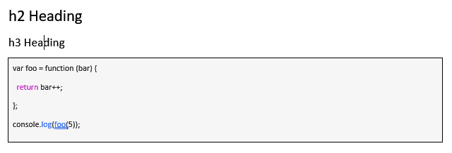

# Markdown2Openxml.NET
Convert Markdown string to Openxml format for Word Document



# Usage of the library
Get the library through nuget
```
dotnet add package Markdown2Openxml
```
Append the Paragraphs to your body with markdown string and the document main part as arguments.
```
body.Append(MarkdownToOpenxmlUtil.markdownToParagraph(mainPart, markdownString));
```

For more details, please refer to the Example
https://github.com/sebastian93921/Markdown2Openxml.NET/blob/main/MarkdownTest/UnitTest1.cs

There is a Code block syntax highlighting method `SimpleSyntaxHighlightUtil.ParselineToHtml` used for Markdig which the keyword highlights as same as the generated document.
Please look into **Custom Rendering** https://github.com/xoofx/markdig/issues/344 to see how to implement it

# Pack the library
Run the following command in project directory
```
dotnet pack
```

# Currently the library supports the following format:
## Heading
```
# Heading1
## Heading2
### Heading3
```

## Bold
```
**Bold**
```

## Italic
```
*Italic*
```

## Inline code
```
norm**al `text`, no** problem
```

## Code Block
```
\\```
Code block
\\```
```

## Table
```
| | |
|---|---|
| | |
```

## Link
```
[Name](http://url)
```

## Image
```

```

## Bullet list
```
- Bullet list
```

## Ordered List
```
1. Order1
2. Order2
```

## Orizontal Rule
```
* * *
```

